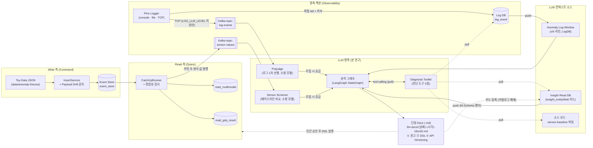
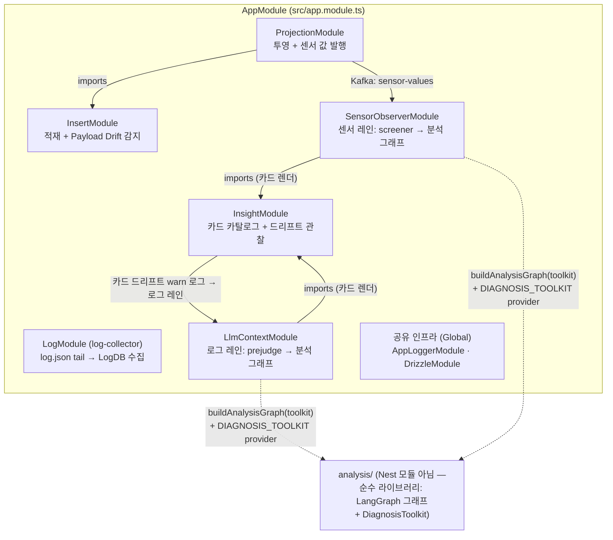
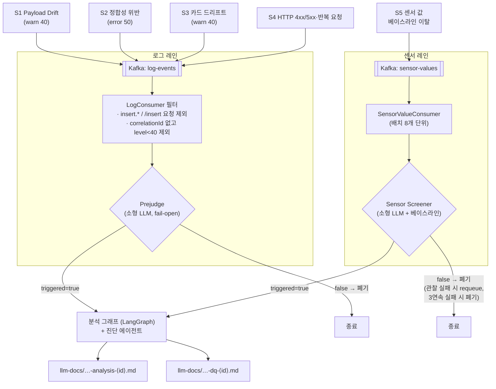
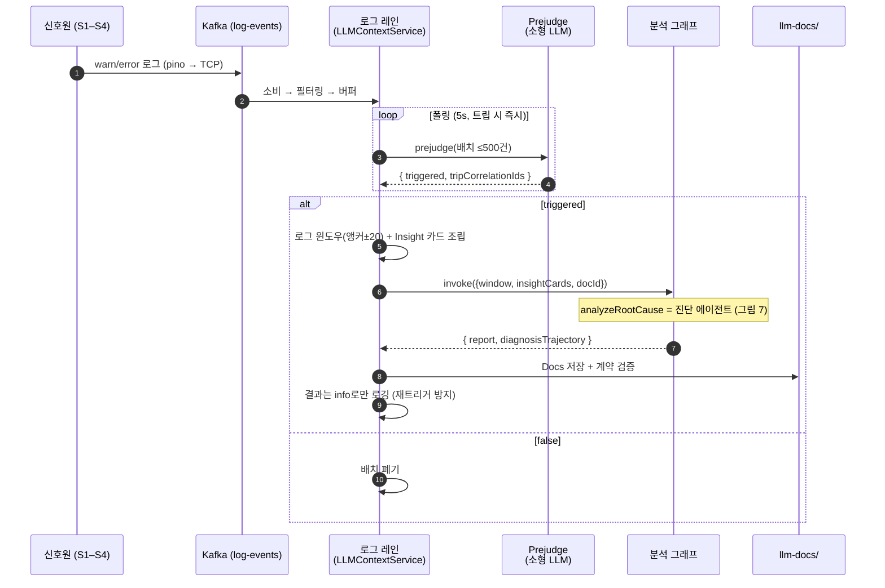
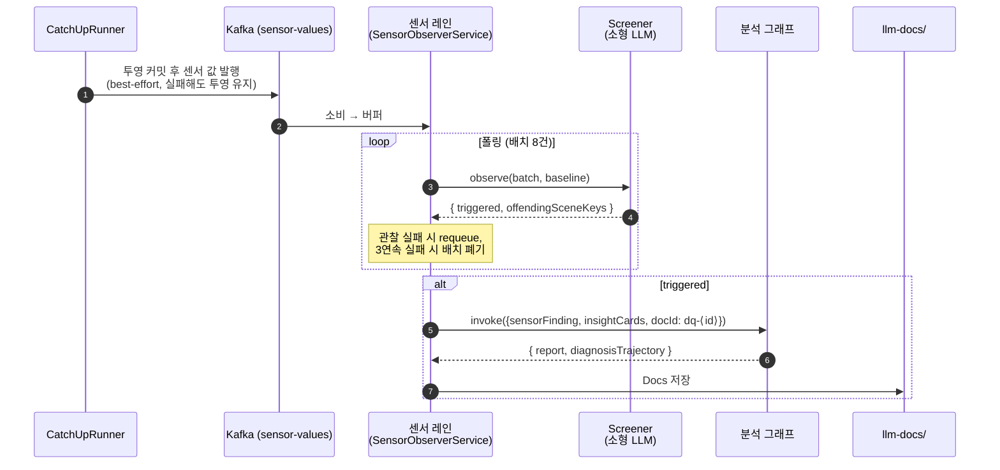
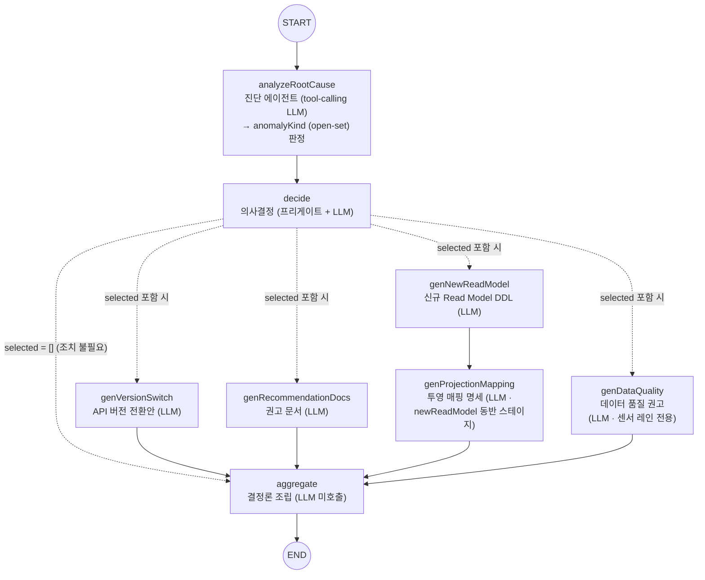
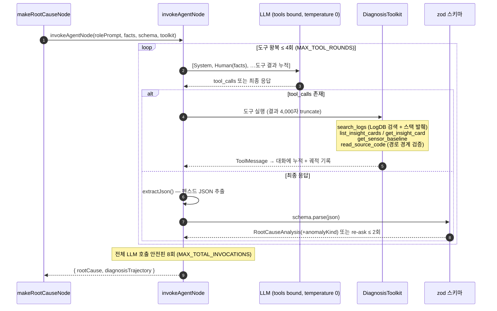
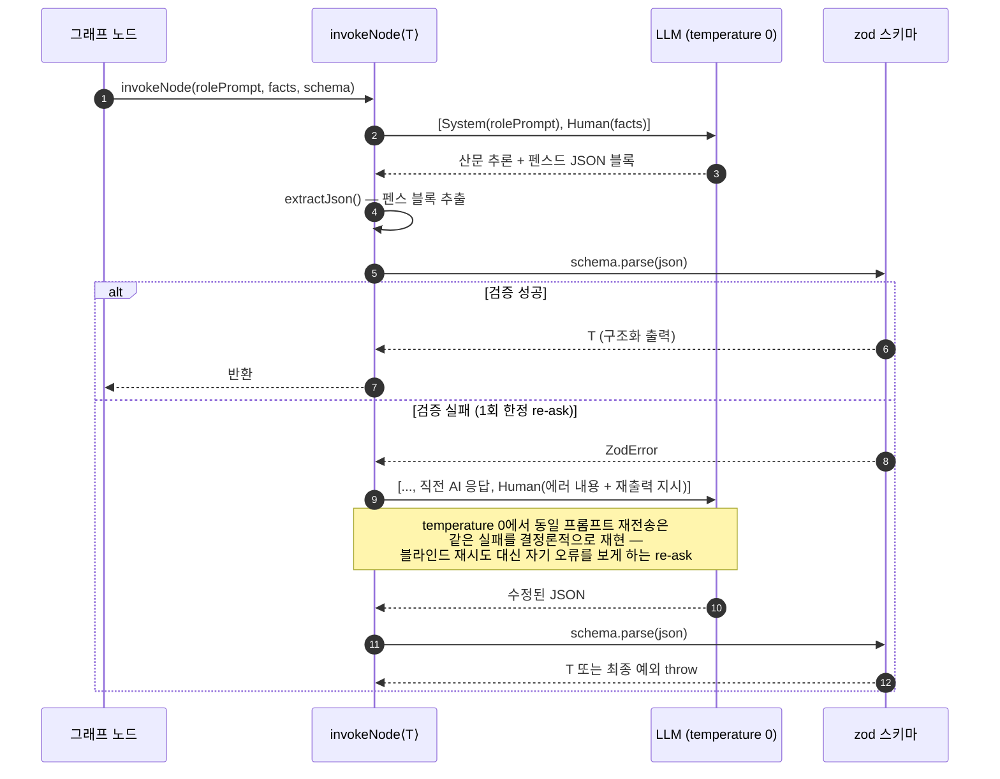
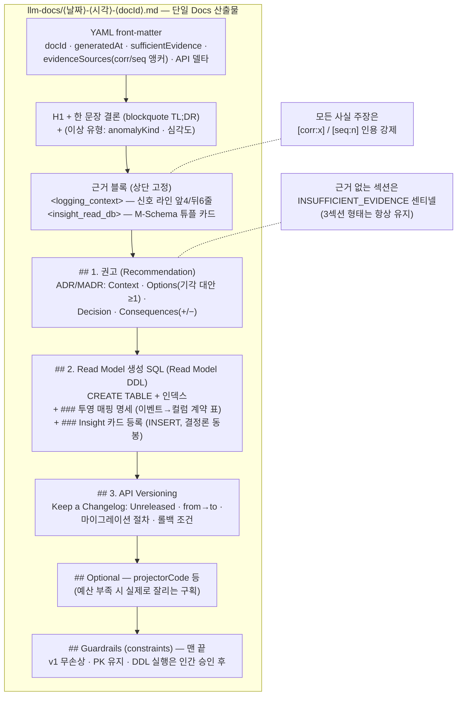
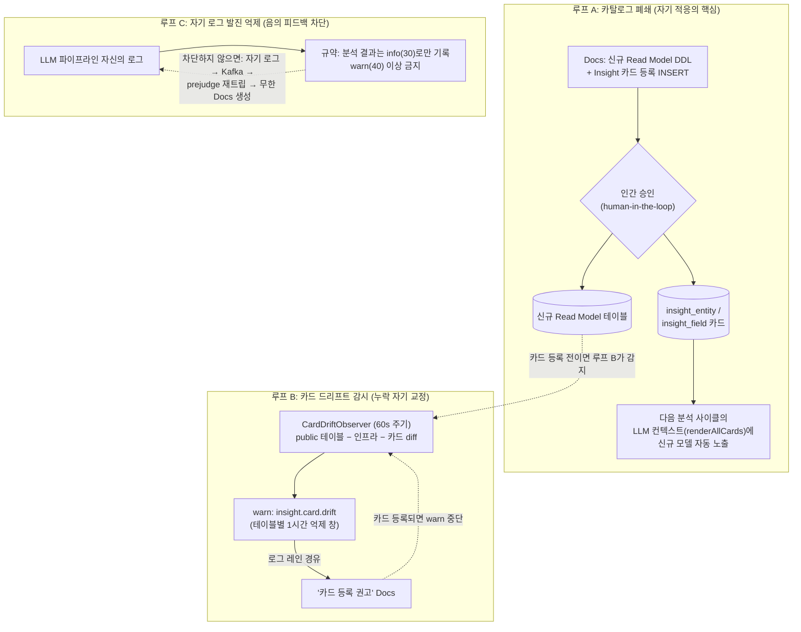

# Self-Adaptive CQRS: LLM 기반 Read Model 자가 적응 아키텍처

> 작성일: 2026-07-04 · 개정: 2026-07-06 (tool-calling 진단 에이전트 · 투영 매핑 명세 반영) · 대상 브랜치: main
> 본 문서는 논문 작성용 그림·다이어그램의 1차 출처(single source of truth)다.
> 모든 그림은 실제 구현(`src/`)에서 역추출했으며, 각 캡션에 근거 파일을 명시한다.

---

## Abstract (초록)

이벤트 소싱 + CQRS 시스템에서 사용자의 새로운 조회 요구가 기존 Read Model로 충족되지
않을 때마다 사람이 새 Read Model을 설계·구현해야 하는 병목이 존재한다. 본 연구는 기존
ES+CQRS 구조 위에 **LLM 영역**을 얹어, 시스템이 스스로 이상(오류·드리프트·베이스라인
이탈)을 감지하고 **권고 문서 + Read Model 생성 SQL + API Versioning** 3요소를 항상 함께
담은 단일 산출물(Docs)을 자동 생성하는 **Self-Adaptive CQRS** 아키텍처를 제안한다.
이상 신호는 (1) 개발자 Logging 기반의 **로그 레인**과 (2) 투영된 센서 값 기반의
**센서 레인** 두 경로로 수집되며, 값싼 소형 모델의 1차 선별(screener)을 통과한 배치만
LangGraph 기반 다단계 분석 그래프로 승급된다. 그래프의 근본원인 분석 단계는 **도구 사용
진단 에이전트**(tool-calling agent)로서 로그 DB·Insight 카탈로그·센서 베이스라인·소스
코드를 스스로 조회하며 이상 유형(anomalyKind)을 open-set으로 판정하고, 이어 의사결정 →
생성기 병렬 fan-out → 결정론적 조립 순으로 Docs를 산출한다. 3단 검증 계층(zod 구조
검증 · substring 환각 제거 · Docs 계약 검증)이 산출물의 신뢰성을 보강하며, 진단
에이전트의 도구 호출 궤적(diagnosis trajectory)은 재현성과 사후 LLM-as-Judge 평가를
위해 전량 기록된다. 생성된 신규 Read Model의 Insight 카드가 다음 분석의 컨텍스트에
자동 편입되는 **카탈로그 폐쇄 루프**를 통해 시스템은 반복적으로 자가 적응한다.

---

## 1. 서론

### 1.1 문제 정의

- **도메인**: Physical AI(로봇 파지 시도 — grip attempt) 데이터를 이벤트 소싱 +
  CQRS로 관리한다. Write 측은 append-only Event Store, Read 측은 목적별
  Read Model(`read_multimodal`, `read_grip_result`)이다.
- **병목**: 사용자의 새 조회 요구가 기존 Read Model에 부합하지 않으면, 그때마다
  사람이 새 Read Model을 설계·구현해야 한다.

### 1.2 제안 — Self-Adaptive CQRS

기존 ES+CQRS 위에 LLM 영역을 도입한다. LLM은 (1) 개발자 Logging, (2) Insight Read DB
두 소스를 컨텍스트로 받아, 이상이 감지될 때마다 다음 3요소를 **항상 함께** 담은 단일
Docs(.md)를 산출한다.

1. **권고 문서** — 어떤 Read Model을 왜/어떻게 재생성·보강해야 하는지 (ADR 형식)
2. **Read Model 생성 SQL** — 실제 실행 가능한 DDL(+ Insight 카드 등록 INSERT)
3. **API Versioning** — Read Model 교체에 따른 API 버전 변경 사항 (Keep a Changelog 형식)

핵심 연구 질문은 *"LLM이 무엇을 컨텍스트로 받아, 사용자가 곧바로 활용 가능한 이
Docs를 어떻게 산출하는가"* 이다. 컨텍스트 주입은 두 방식이 공존한다 — 파이프라인이
**밀어 넣는(push)** 이상 로그 윈도우·Insight 카드와, 진단 에이전트가 도구로
**끌어오는(pull)** 로그 DB 검색·소스 코드 발췌(§5.2)다.

---

## 2. 전체 아키텍처

### 그림 1 — 시스템 전체 아키텍처 (계층 뷰)

기존 ES+CQRS 영역(좌)과 본 연구가 추가한 LLM 영역(우)의 관계. 모든 이상 신호는
Kafka의 두 토픽(`log-events`, `sensor-values`)으로 수렴하고, 두 레인은 동일한 분석
그래프로 합류하여 단일 Docs를 산출한다.

**그림 1.** Self-Adaptive CQRS 전체 아키텍처. 실선은 자동 데이터 흐름, 점선은
human-in-the-loop 게이트를 거치는 적용 경로 및 진단 에이전트의 pull형 도구 조회다.
컨텍스트는 파이프라인이 밀어 넣는 push(로그 윈도우·Insight 카드)와 진단 에이전트가
필요 시 끌어오는 pull(도구 5종) 두 방식이 공존한다. 근거:
`src/insert/insert.service.ts`, `src/projection/runner/catch-up.runner.ts:98,152-180`,
`src/shared/logger/logger.module.ts:46-60,95-97`, `src/llm-context/llm-context.service.ts`,
`src/sensor-observer/sensor-observer.service.ts`, `src/analysis/tools/diagnosis-toolkit.ts`.

### 그림 2 — 컴포넌트(NestJS 모듈) 다이어그램

**그림 2.** 모듈 의존 관계. `analysis/`(분석 그래프 + 진단 툴킷)는 NestJS 모듈이 아닌
순수 라이브러리로, `LlmContextModule`과 `SensorObserverModule`이 각자
`DIAGNOSIS_TOOLKIT` provider(`DiagnosisToolkitImpl`)를 등록하고
`buildAnalysisGraph(toolkit)`으로 인스턴스화한다. `InsightModule`은 두 레인이 공유하는
카탈로그 허브다. 근거: `src/app.module.ts:14-24`, `src/llm-context/llm.module.ts:1-14`,
`src/sensor-observer/sensor-observer.module.ts:1-12`, `src/analysis/annalysis.graph.ts:22`.

---

## 3. 이상 신호 분류 (Anomaly Signal Taxonomy)

시스템이 스스로 방출하는 이상 신호는 아래 5종이며, 전부 두 레인 중 하나로 수렴한다.
로그 레인의 신호는 모두 **"pino level ≥ 40(warn)"** 이라는 단일 규약을 따른다 —
새 탐지기를 추가하려면 warn/error 로그 한 줄만 찍으면 파이프라인에 자동 편입된다.

| # | 신호 | 발생 지점 | 레벨/경로 | 의미 |
|---|---|---|---|---|
| S1 | Payload Schema Drift | `insert.service.ts:85-92` (감지: `insert/drift/payload-drift.detector.ts`) | warn(40) → 로그 레인 | 스키마가 모르는 신규 키 유입 — 적재 시 유실, Read Model 후보 |
| S2 | Projection Integrity Violation | `catch-up.runner.ts:216-229` (호출: `:101`) | error(50) → 로그 레인 | 투영 커밋 후 정합성 규칙 위반 |
| S3 | Insight Card Drift | `card-drift.observer.ts:54-61` | warn(40) → 로그 레인 | 카드 없는 Read Model 테이블 발견(카탈로그 드리프트) |
| S4 | HTTP 이상 / 반복 요청 | `logger.module.ts:84-94` | 4xx→warn, 5xx→error → 로그 레인 | 요청 충족 실패, 존재하지 않는 리소스 조회 등 |
| S5 | 센서 값 베이스라인 이탈 | `catch-up.runner.ts:98,152-180` → `sensor-value.publisher.ts` | `sensor-values` 토픽 → 센서 레인 | 값 자체는 오류가 아니므로 로그 규약이 아닌 별도 토픽 |

### 그림 3 — 신호 → 레인 → 판정 경로

**그림 3.** 5종 이상 신호의 수렴 경로. 두 스크리너는 "들여다볼 가치가 있는가"만
판정하며(2-pass 게이트), 근본원인·조치 판단은 전적으로 분석 그래프의 몫이다.
Prejudge는 애매하면 `triggered=true`로 두는 fail-open 정책을 쓰고, 배치를 표로
압축하지 않고 원본 JSON 라인 그대로 전달해 맥락 필드 손실을 막는다. 근거:
`src/llm-context/screener/prejudge.ts:37-70`, `src/llm-context/kafka/log-consumer.ts:71-117`,
`src/sensor-observer/sensor-screener.ts`, `src/sensor-observer/sensor-observer.service.ts:79-115`.

---

## 4. 시퀀스 — 두 레인 (이상 감지 → Docs 산출)

두 레인은 구조적으로 대칭이다: **수집(Kafka) → 1차 선별(소형 LLM) → 트립 시 분석
그래프 승급 → Docs 산출**. 다른 것은 입력 채널(`window` vs `sensorFinding`)뿐이다.

### 그림 4 — 로그 레인 시퀀스

**그림 4.** 로그 레인 시퀀스. 핵심 설계는 마지막 단계다 — 이 서비스의 로그도 Kafka로
재유입되므로 분석 결과를 warn/error(≥40)로 찍으면 자기 로그가 이상 탐지를 재트리거하는
발진(feedback oscillation)이 생긴다. 따라서 결과는 `info`로만 기록하며, 이때 진단
에이전트의 도구 호출 궤적(`diagnosisTrajectory`)도 함께 남긴다(Docs에는 미포함, §8).
근거: `src/llm-context/llm-context.service.ts:38-146`,
`src/llm-context/repository/log-window.repository.impl.ts`.

### 그림 5 — 센서 레인 시퀀스

**그림 5.** 센서 레인 시퀀스. 로그 레인과 동일한 폴링 루프·동일한 분석 그래프를
공유하되 입력 채널만 `sensorFinding`을 채운다 — 둘 중 non-null인 쪽이 그래프 내부의
소스 판별자다. 로그 레인과 다른 점은 둘: 발행이 best-effort(Kafka 장애가 투영을
막지 않음)이고, 관찰 실패 시 **requeue + 3연속 실패 폐기 스트릭**으로 일시 장애를
흡수한다. 근거: `src/sensor-observer/sensor-observer.service.ts:79-157`,
`src/projection/kafka/sensor-value.publisher.ts`, `src/analysis/analysis.state.ts:11-19`.

---

## 5. LLM 판정 — 분석 그래프 내부

### 5.1 그림 6 — LangGraph 상태 그래프 토폴로지

**그림 6.** 분석 그래프 토폴로지. 진입 노드 `analyzeRootCause`는 one-shot 호출에서
**도구 사용 진단 에이전트**(그림 7)로 승격되었다 — `buildAnalysisGraph(toolkit)`에
툴킷이 주입되면 에이전트로, `null`이면 기존 one-shot으로 동작하는 하위호환 분기다
(`root-cause.node.ts:23-33`). 상태 채널에는 도구 호출 궤적
`diagnosisTrajectory: string[]`가 추가되었다. `decide`의 조건부 에지는 노드 이름
**배열**을 반환하여 선택된 생성기들을 병렬 fan-out하고, `outputs` 채널의
spread-merge reducer(`{...prev, ...next}`)가 병렬 결과의 합류 지점이다.
`genProjectionMapping`은 decide가 고르는 OutputKind가 **아니라** `genNewReadModel`의
**결정론 동반 스테이지**다 — 매핑 명세는 방금 설계된 컬럼(fields)을 봐야 성립하므로
fan-out이 아니라 체인으로 붙고, newReadModel 출력이 없으면(미선택·degrade) 조용히
통과한다. 행동 목록(닫힌 enum)을 늘리지 않으면서 산출물을 보강하는 위치다. 두 개의
결정론 가드가 LLM의 확률적 오판을 막는다: (a) `decide`의 프리게이트 — 트립 앵커가
`insight.card.miss` 단독이면 LLM 호출 없이 `selected: []` 확정, (b) 정합성 불변식 —
산출물(DDL/버전)을 골랐는데 권고 계열이 없으면 `recommendationDocs`를 강제 동반.
`aggregate`는 개별 생성기가 런타임에 degrade했을 때도 같은 불변식을 재검사한다
(`lacksRecommendationBasis`). 근거: `src/analysis/annalysis.graph.ts:22-77`,
`src/analysis/analysis.state.ts:34-39`, `src/analysis/nodes/decision.node.ts:13-45`,
`src/analysis/nodes/projection-mapping.node.ts`, `src/analysis/nodes/aggregate.node.ts:9-17`.

### 5.2 그림 7 — 진단 에이전트: 도구 사용 근본원인 분석

근본원인 분석은 더 이상 "주어진 컨텍스트만 보고 한 번에 판정"하지 않는다. 에이전트가
필요한 증거를 도구로 직접 끌어와(pull) 이상 유형을 open-set 문자열(`anomalyKind`)로
명명한다.

**그림 7.** 진단 에이전트의 ReAct형 루프. 세 겹의 상한(도구 왕복 4회 · 최종 출력
re-ask 2회 · 전체 호출 8회)과 도구 결과 4,000자 truncate가 무한 루프와 컨텍스트
폭주(Context Rot)를 구조적으로 차단한다. 도구 호출 궤적은 상태 채널
`diagnosisTrajectory`로 수집되어 서비스 로그에만 기록된다(Docs 미포함) — 이 궤적이
사후 LLM-as-Judge 평가(§8)의 입력이 된다. 외부 APM(Sentry) 도입 대신 자체 도구
(search_logs의 스택 발췌 + read_source_code)로 대체한 결정과 그 사유는
`docs/analysis/tool-calling-diagnosis-agent.md`에 문서화되어 있으며, pino 로거에
`err` serializer를 추가해 스택을 보존한 것이 이 도구들의 전제조건이다. 근거:
`src/analysis/nodes/invoke-agent.ts:11-15,37-43`, `src/analysis/tools/diagnosis-toolkit.ts:32`,
`src/analysis/tools/diagnosis-toolkit.impl.ts`, `src/analysis/nodes/root-cause.node.ts:11-33`,
`src/shared/logger/logger.module.ts`.

#### 표 1 — 진단 도구 5종 명세

| 도구 | 역할 (언제 쓰는가) | 입력 | 안전장치 |
|---|---|---|---|
| `search_logs` | 로그 DB(`log_event`) 조건 조회 — correlationId로 한 요청의 전체 트레이스 추적, action/minLevel로 반복 패턴·에러 이력 확인. payload의 `err`/`error` 키에서 스택 **상단 6프레임만 발췌**해 동봉(전체 payload는 토큰 잠식이라 미포함) | correlationId · action · sceneKey · minLevel · limit | limit 상한 40행 · 결과 4,000자 truncate |
| `list_insight_cards` | 카탈로그의 엔티티(Read Model·Event) 이름 목록 — 어떤 카드가 존재하는지 파악하는 탐색 진입점 | (없음) | 4,000자 truncate |
| `get_insight_card` | 카드 1장(컬럼·의미·예시) 반환 — 로그가 가리키는 테이블/이벤트의 현재 스키마와 대조 | entityName | 4,000자 truncate |
| `get_sensor_baseline` | 수기 베이스라인(규칙명·기대범위) 반환 — 관측값의 물리적 타당성과 이탈 정도 판정 | (없음) | 4,000자 truncate |
| `read_source_code` | 소스 파일을 라인 번호와 함께 읽기 전용 열람 — 스택의 파일:라인을 열어 "코드 어느 줄이 왜 실패했나" 확인 | filePath · startLine · endLine | **default-deny 경로 경계**: 정규화 후 저장소 내부 + 최상위 `src/`·`dist/`만 허용(`../` 탈출, `.env`, `node_modules`, `src/../.env` 위장 탈출 차단) · 한 번에 최대 120줄 · 파일 없음은 throw 대신 에이전트가 읽을 수 있는 실패 메시지 |

**표 1.** 진단 도구 명세. 도구 description은 모델이 도구를 고르는 유일한 근거이므로
"언제 쓰는가"를 명시하며, 프롬프트(`DIAGNOSIS_TOOLS_GUIDE`)는 "카드로 확인하기 전
'컬럼 없음' 단정 금지, 도구 결과가 발췌와 모순되면 도구 결과 우선" 등 증거 우선
규칙과 '스택→소스' 워크플로(search_logs로 파일:라인 확보 → read_source_code로 해당
라인 주변만 열람, 파일 전체 훑기 금지)를 지시한다. 전형적 진단 루프는 **search_logs
(에러+스택 확보) → read_source_code(실패 지점 열람) → 카드·베이스라인 대조 →
anomalyKind 판정** 순이다. 근거: `src/analysis/tools/diagnosis-toolkit.ts:43-125`,
`src/analysis/tools/diagnosis-toolkit.impl.ts`(경계 테스트:
`diagnosis-toolkit.impl.spec.ts` 9건), `src/analysis/prompts/index.ts`.

#### 설계 원칙 — 감지는 open, 행동은 closed

기존에는 5가지 고정 분류를 프롬프트에 열거해 판정했으나, 에이전트 전환 후
`anomalyKind`는 **open-set 자유 문자열**이 되어 미리 열거하지 않은 미지의 이상
유형도 스스로 명명한다. 반면 이후 행동을 결정하는 `outputKindSchema`
(versionSwitch / recommendationDocs / newReadModel / dataQualityRecommendation)는
여전히 **닫힌 enum**이다 — 미지 신호가 미지 행동으로 이어지지 않게 하는 경계다.
산출물을 보강할 때도 이 enum은 늘리지 않는다: 투영 매핑 명세(`projectionMapping`)는
새 OutputKind가 아니라 `newReadModel`의 동반 스테이지로 붙어(그림 6), decide의 선택
공간(오선택 위험)을 키우지 않는다. 비용 구조도 같은 원리로 나뉜다: 모든 배치에
실행되어 **비용을 지배**하는 1차 스크리너(prejudge·sensor screener)는 프롬프트
기반을 유지하고, 트리거된 소수의 2차 진단에만 붙는 에이전트가 **품질을 지배**한다.
근거: `docs/analysis/tool-calling-diagnosis-agent.md`, `src/analysis/type/output.type.ts`.

### 5.3 그림 8 — 노드 공통 LLM 호출 규약: 산문 CoT → 펜스드 JSON → zod → re-ask

진단 에이전트를 제외한 모든 노드(decide · 생성기 4종 · 투영 매핑)와, 툴킷 미주입
시의 근본원인 분석이 공유하는 단일 호출 경로다.

**그림 8.** 모든 그래프 노드가 공유하는 단일 LLM 호출 경로. 구조화 출력 API(JSON
모드) 대신 "자유 산문 추론 후 펜스드 JSON"을 쓰는 이유는 grammar-constrained
decoding이 소형/로컬 모델의 추론 품질을 저해한다는 연구 결과(arXiv:2408.02442)에
근거한다. 진단 에이전트(그림 7)도 도구 루프가 끝난 결말부에서는 이 규약(펜스드
JSON → zod → re-ask)을 그대로 재사용한다. 근거: `src/analysis/nodes/invoke.ts:12,34-51`,
계약 테스트 `src/analysis/nodes/invoke.spec.ts`, `src/analysis/nodes/invoke-agent.spec.ts`.

---

## 6. 산출물 — 단일 Docs의 구조

### 그림 9 — Docs 레이아웃 (U자형 배치)

**그림 9.** Docs 산출물의 고정 레이아웃. 결론(최상단)과 제약(최하단)을 양 끝에
두는 U자형 배치는 "Lost in the Middle"(arXiv:2307.03172) 현상에 대응하며, 근거
블록을 결론보다 구조적으로 앞에 고정하는 것은 사후 합리화(post-hoc rationalization)
방지 설계다. TL;DR에는 진단 에이전트가 판정한 open-set 이상 유형(`anomalyKind`)과
심각도가 함께 표기된다 — 진단 에이전트의 판정이 Docs에 노출되는 유일한 지점이다
(궤적 자체는 미포함). §2의 **투영 매핑 명세**(원천 이벤트 payload 필드 → 컬럼 → 변환
규칙 표 + 파생 컬럼 + upsert 키·리플레이 주의)는 projector 코드의 대조 계약으로,
코드(Optional — 예산 부족 시 잘림)와 달리 코어에 남는다: DDL만으로는 빈 테이블이므로
사람이 Read Model을 실제로 채우는 데 필요한 정보를 코어 예산 안에 보존하는 배치다.
코어는 8,000토큰 목표/20,000토큰 하드캡(3자/토큰 근사)의 예산을 따른다 — 이 Docs
자체가 다시 소형 LLM의 컨텍스트로 주입되는 것을 전제하기 때문이다. 근거:
`docs/analysis/docs-format-spec.md`, `src/analysis/render.ts`,
`src/analysis/validate-docs.ts`, `src/analysis/report-filename.ts:8`.

### 표 2 — 3단 검증 계층

| 단계 | 위치 | 잡는 것 | 못 잡는 것 |
|---|---|---|---|
| ① zod 구조 검증 | `invoke.ts` · `invoke-agent.ts` (그림 7·8) | JSON 파싱 실패 · 필드 누락 · 타입 불일치 · 네이밍 regex 위반 | 구조는 맞지만 내용이 지어낸 값 |
| ② 그라운딩(환각 제거) | `data-quality.node.ts:32-44` · `projection-mapping.node.ts` (`groundMappingRows`) | 입력에 실재하지 않는 값 제거 — `sensorEvidence[].observedValue`는 근거 텍스트 substring, 매핑 행은 `targetColumn`(설계 fields 대조) + `sourceField`(카드·근거 substring) 양끝 검증. 근거 0개면 출력 폐기 | 해당 필드 밖 서술의 사실성 |
| ③ Docs 계약 검증 | `validate-docs.ts:14-138` | front-matter 존재 · 3섹션 고정 순서 · Guardrails 존재 · 센티넬-플래그 정합 · 인용 앵커 실재성 · 토큰 예산 | 검증 실패 시 재실행/루프백 없음(현재는 기록만) |

검증 계층과 별개로, 진단 에이전트의 도구 결과 4,000자 truncate(그림 7)는 잘못된
증거가 아니라 **과다한 증거**로부터 판정 품질을 지키는 컨텍스트 통제 장치다.

---

## 7. 자기 적응 피드백 루프

### 그림 10 — 세 가지 피드백 루프

**그림 10.** 자기 적응을 구성하는 세 루프. 루프 A는 신규 Read Model의 구조적
출력(proposedName/keyColumns/fields)이 Insight 카드 스키마와 동형이라 LLM 재호출
없이 INSERT SQL로 결정론 변환되는 성질을 이용한다 — DDL과 카드를 함께 적용해야
다음 분석부터 신규 모델이 카탈로그에 보인다(카탈로그 폐쇄). 루프 B는 사람이 카드
등록을 잊은 경우를 fail-loud로 회수하는 안전망이고, 루프 C는 파이프라인이 자기
로그로 자기를 재트리거하는 발진을 차단하는 음의 피드백이다. 근거:
`docs/analysis/docs-format-spec.md` 규칙 11, `src/insight/observer/card-drift.observer.ts:25-61`,
`src/llm-context/llm-context.service.ts:131-132`.

---

## 8. 평가를 위한 장치 — 진단 궤적과 LLM-as-Judge (계획)

진단 에이전트의 모든 도구 호출·응답은 `diagnosisTrajectory` 채널로 수집되어 두 레인
서비스의 완료 로그에 전량 기록된다(`llm-context.service.ts:135-146`,
`sensor-observer.service.ts:176`). 이 궤적은 Docs에는 포함되지 않으며(Context Rot
방지), 다음 두 용도를 위한 것이다.

1. **재현성** — 어떤 증거를 어떤 순서로 조회해 판정에 이르렀는지의 감사 추적.
2. **사후 평가** — `docs/evaluation/performance-evaluation-plan.md`가 정의하는 3층
   평가(탐지 정확도 / Docs 품질 / 다운스트림 효과) 중 층2의 **LLM-as-Judge 채점**
   (+ 사람 30% 샘플 검증, Cohen's κ) 입력.

> **주의(논문 기술 시).** LLM-as-Judge 채점기 자체는 현재 **미구현**이며 평가 계획
> 문서로만 존재한다. 구현된 것은 채점의 전제가 되는 궤적 기록까지다. 커밋 이력의
> "llm judge" 라벨은 이 궤적 기록 + 진단 에이전트 전환 작업을 가리킨다.

---

## 9. 운영 파라미터 요약

| 파라미터 | 값 | 근거 파일 |
|---|---|---|
| 로그 배치 상한 / 폴링 간격 | 500건 / 5s (트립 시 지연 0) | `log-consumer.config.ts:4-5` |
| 센서 관찰 배치 / 폴링 간격 | 8건 / 5s | `projection/kafka/sensor-observer.config.ts:6-7` |
| 이상 레벨 임계 | pino level ≥ 40 (warn) | `log-consumer.config.ts:6` |
| 로그 윈도우 | 앵커 ±20행, 상한 80행, 신호 앞4/뒤6줄 프루닝 | `log-window.config.ts:2-9` |
| 카드 드리프트 검사 / 억제 창 | 60s / 1h | `card-drift.config.ts:2,5` |
| LLM temperature | 0 (prejudge·분석·센서 관찰 공통) | `analysis.config.ts:6`, `prejudge.config.ts:6` |
| 출력 토큰 상한 | prejudge 1,024 / 센서 관찰 2,048 / 분석 노드 8,192 | `prejudge.config.ts:9`, `sensor-screener.ts:21-23`, `analysis.config.ts:10` |
| invokeNode 재시도 | 최대 2회 시도(re-ask 1회) | `invoke.ts:12` |
| 진단 에이전트 상한 | 도구 왕복 4회 · 최종 re-ask 2회 · 총 호출 8회 | `invoke-agent.ts:11-15` |
| 도구 결과 truncate | 4,000자/도구 | `diagnosis-toolkit.ts:32` |
| 센서 관찰 실패 스트릭 | 3연속 실패 시 배치 폐기 (그 전엔 requeue) | `sensor-observer.service.ts:82` |
| Docs 토큰 예산 | 목표 8K / 하드캡 20K (3자/토큰 근사) | `validate-docs.ts:30-31` |
| 산출물 디렉터리 / 파일명 | `llm-docs/` / `⟨YYYY-MM-DD⟩-⟨HHmmss⟩-⟨docId⟩.md` | `report-filename.ts:8` |

---

## 부록 A. 그림-구현 대응표

| 그림 | 주제 | 1차 근거 파일 |
|---|---|---|
| 그림 1 | 전체 아키텍처 | `app.module.ts` 및 각 모듈 서비스 |
| 그림 2 | 모듈 다이어그램 | `src/*/**.module.ts`, `annalysis.graph.ts:22` |
| 그림 3 | 이상 신호 분류 | §3 표의 5개 발생 지점 |
| 그림 4 | 로그 레인 시퀀스 | `llm-context.service.ts` |
| 그림 5 | 센서 레인 시퀀스 | `sensor-observer.service.ts` |
| 그림 6 | 분석 그래프 토폴로지 | `annalysis.graph.ts`, `nodes/projection-mapping.node.ts` |
| 그림 7 | 진단 에이전트 (tool-calling) | `nodes/invoke-agent.ts`, `tools/diagnosis-toolkit.ts` |
| 그림 8 | LLM 호출 규약 | `nodes/invoke.ts` + `invoke.spec.ts` |
| 그림 9 | Docs 레이아웃 | `docs/analysis/docs-format-spec.md` |
| 그림 10 | 피드백 루프 | `card-drift.observer.ts` 외 |

## 부록 B. 관련 문서

- LangGraph 파이프라인 상세: `docs/langchain-pipeline.md`
- Tool-calling 진단 에이전트 설계(Sentry 비채택 사유 포함): `docs/analysis/tool-calling-diagnosis-agent.md`
- Docs 산출물 포맷 계약(16규칙): `docs/analysis/docs-format-spec.md`
- 성능 평가 계획(LLM-as-Judge, 미구현): `docs/evaluation/performance-evaluation-plan.md`
- 센서 관찰자 구현 가이드: `docs/llm-context/구현가이드-센서값-이상관찰자.md`
- 정합성 판정 레인 설계: `docs/projection/제네릭-정합성-판정-레인-설계.md`
- 연구 계획서(1차 출처): `data/research/page1.png ~ page5.png`
