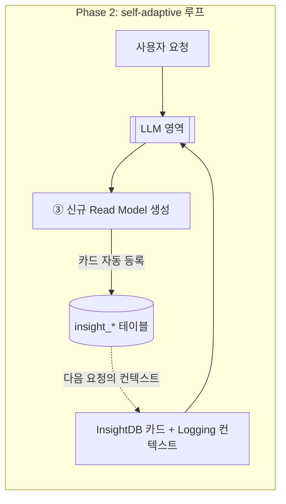

# Insight Read DB → LLM 컨텍스트 파이프라인 설계

> **문서 성격**: 설계 문서(아키텍처/데이터 흐름 정의). 본 문서는 코드를 포함하지 않으며,
> 후속 구현 작업의 청사진이다.
> **작성 기준**: `CLAUDE.md` 연구 다이제스트 + `data/research/page1~5.png`(1차 출처, 충돌 시 우선).
> **짝 문서**: `docs/llm-context-log.md`((1) Logging 소스). 본 문서는 **(2) Insight Read DB 소스**를 다룬다.

---

## 1. 개요 — 연구 내 위치

Self-Adaptive CQRS의 핵심 질문은 **"LLM이 무엇을 컨텍스트로 받아 Read Model을 자가 적응적으로 바꾸는가"**이다.
연구 다이제스트에 따르면 LLM 컨텍스트는 두 소스에서 생성된다.

| 소스                   | 내용                                 | 답하는 질문                          | 본 문서 범위                |
| ---------------------- | ------------------------------------ | ------------------------------------ | --------------------------- |
| (1) 개발자 Logging     | 시스템이 런타임에 남기는 구조화 로그 | "운영 중 무엇이 실패/지연됐나"       | `llm-context-log.md`        |
| **(2) Insight Read DB**| 도메인 인사이트용 Read DB            | "도메인 데이터가 실제로 어떻게 생겼나" | ✅ **본 문서가 다루는 영역** |

두 소스는 LLM의 **3가지 출력**으로 이어진다는 점에서 같지만, 역할이 다르다.

1. **Read Model 버전 교체** — 기존 Read Model의 다른 버전으로 스위치
2. **Read Model 권고 문서 생성** — 어떤 Read Model을 어떻게 보강할지 가이드 산출
3. **신규 Read Model 생성** — 요청을 만족하는 새 Read Model 자동 구성

> **Logging은 "지금 뭔가 잘못됐다"는 트리거**를, **InsightDB는 "그래서 어떤 Read Model을 만들/바꿔야 하는가"의 도메인 근거**를 준다.
> 문제 신호만으로는 *어떤 모양*의 Read Model을 만들지 알 수 없고, 그 모양은 도메인 데이터의 실제 분포(InsightDB)에서 나온다.

---

## 2. InsightDB란 무엇인가 — 정의

> **InsightDB = 도메인 payload의 실제 모양(필드·값·분포)과 현존 Read Model 카탈로그(각각 무엇을 저장하는지)를,
> 작은 LLM(예: 10B급)도 그대로 읽고 판단할 수 있도록 명시적으로 풀어 적재한 Read DB.**

설계 성격을 결정하는 핵심 제약은 **"작은 모델도 추론할 수 있을 만큼"**이다.

- 큰 모델은 raw payload를 던져줘도 스스로 패턴을 추론하지만, 10B급은 그게 약하다.
- 따라서 InsightDB는 *원본 덤프*가 아니라 **명시적으로 정리된 사실**(필드 목록 + 실제 값 예시 + enum/분포 + 각 Read Model이 뭘 저장하는지)을 담는다.
- 즉 InsightDB의 품질 기준은 **rawness가 아니라 explicitness**다 — 추론을 데이터로 미리 풀어둔다.

### Logging 소스와의 본질적 차이

| 축          | Logging 소스                       | Insight Read DB                          |
| ----------- | ---------------------------------- | ---------------------------------------- |
| 신호 성격   | 시변(time-varying) 운영 신호       | 상대적으로 안정적인 도메인 지식          |
| 적합 저장   | 시계열 DB(TimescaleDB hypertable)  | 카탈로그/프로파일 형태(정형 테이블)      |
| 트리거      | 문제 발생 (push)                   | 사용자 요청 시 조회 (pull)               |
| 예시        | grip 실패율 급증, projection lag   | `gripper_type ∈ {finger, suction}`, 성공률 0.73 |

---

## 3. 담는 내용 — 두 종류의 카드

InsightDB는 두 덩어리의 지식을 담되, **동일한 카드 스킴**으로 통일한다.
작은 모델에게는 *모든 카드가 똑같은 모양*인 것이 결정적이다(형태가 일정해야 추론이 패턴화됨).

| 카드 종류        | 비유       | 출처(인트로스펙션)                              | 역할                                   |
| ---------------- | ---------- | ----------------------------------------------- | -------------------------------------- |
| **A. 이벤트 카드** | 재료창고   | `event_store.payload` 구조 = zod `toyDataSchema` | "아직 Read Model로 안 꺼낸 필드가 뭔가" |
| **B. Read Model 카드** | 완성품진열대 | `read_*` Drizzle 스키마 + 실제 행 통계         | "지금 무엇을 제공 중인가"               |

> **A 카드가 있어야 "신규 Read Model 생성"이 가능하다.** B(카탈로그)만 보면 *기존에 뭐가 있나*만 알지만,
> A(원천 payload 프로파일)를 봐야 LLM이 *아직 Read Model로 안 꺼낸 어떤 필드*로 새 모델을 구성할지 판단한다.

---

## 4. 포맷 계약 — 두 층의 분리

"포맷"은 두 층이며, 섞으면 안 된다.

| 층                | 결정                                                              | 이유                                              |
| ----------------- | ---------------------------------------------------------------- | ------------------------------------------------- |
| **주입(injection)** | **하이브리드 데이터 카드**(마크다운: 헤더 + 필드표)              | 10B 모델이 추론 없이 그대로 읽음                  |
| **저장(storage)**   | **구조화 `insight_*` 테이블** → 렌더러가 카드로 변환             | 단일 진실원(SSOT), `값/분포`만 독립 재계산        |

> **"작은 모델도 읽을 수 있게"라는 제약은 오직 주입 포맷에만 걸린다.** 저장 포맷은 시스템이 갱신·질의하기 좋으면 된다.
> 그래서 합의 순서는 **주입 포맷 먼저 → 그것이 저장 포맷을 거꾸로 규정** 이었다.

### 4.1 주입 포맷 — 하이브리드 데이터 카드

공통 카드 = **헤더 + 필드표**.

- 헤더: `이름` · `용도(한 줄)` · `키` · `갱신시각/행수`
- 필드표 컬럼: `필드 | 타입 | 의미 | 값/분포 | 예시`

**B. Read Model 카드 예시**

```markdown
## ReadModel: read_grip_result
용도: 장면별 로봇 파지 결과 조회 (성공여부·포즈·그리퍼)
키: (scene_key, attempt_num) · 행수 4,812 · 갱신 2026-06-15

| 필드          | 타입     | 의미             | 값/분포                                  | 예시                  |
| ------------- | -------- | ---------------- | ---------------------------------------- | --------------------- |
| object_name   | varchar  | 파지 대상 객체명 | 1,200종(상위20=80%)                      | 강아지공룡알장난감    |
| grip_succeed  | smallint | 파지 성공여부    | 0/1, 성공률 0.73                         | 1                     |
| gripper_type  | varchar  | 그리퍼 종류      | finger/suction                           | finger                |
| grip_3d_pose  | jsonb    | 3D 파지점        | finger=x1..z8(24), suction=x,y,z,roll..  | {x1:..}               |
```

**A. 이벤트 카드 예시** (출처: `toyDataSchema`)

```markdown
## Event: GripAttemptRecorded
용도: 원천 파지 시도 1건의 전체 payload (Read Model의 재료)
키: (stream_id, attempt_num)

| 필드                  | 타입   | 의미            | 값/분포                                                 | 예시        |
| --------------------- | ------ | --------------- | ------------------------------------------------------- | ----------- |
| grip_succeed          | number | 파지 성공여부   | 0/1                                                     | 1           |
| grip_data.grip_3d_pose| object | 3D 파지점       | x1..z8 (24필드 좌표)                                    | {x1:..}     |
| objects[].class_name  | string | 객체 클래스명   | 카디널리티 = object 종류 수                             | 강아지공룡알장난감 |
| robot_tf              | object | 로봇 변환행렬   | rotation_3x3(9) + translation_3x1(3)                    | {...}       |
| segmentation_points   | array  | 객체 윤곽 좌표  | redact 대상(민감/대용량)                                | [...]       |
| video_file_name       | string | 원천 비디오     | scene당 1개(attempt N:1 비디오)                         | ..._00_..mp4 |
```

> 각 카드 필드는 명시적 타입으로 정의한다(`any` 미사용). `값/분포`만 시변(time-varying)이고
> 나머지(이름·타입·의미·예시)는 거의 불변이다.

### 4.2 저장 포맷 — 3테이블 구조

"구조화 테이블 → 렌더링"을 고른 순간, 테이블 분해는 카드 골격에서 거의 자동으로 따라온다.
특히 **"`값/분포`만 시변"** 이라는 성질이 분해를 깔끔하게 만든다.

```
insight_entity              한 카드 = 한 행      ← 거의 불변(정의)
  └ insight_field           한 필드 = 한 행      ← 거의 불변(정의)
      └ insight_field_stat  통계만 분리          ← 유일한 시변부
```

| 테이블               | 컬럼(개념)                                                              | 변경 빈도 |
| -------------------- | ----------------------------------------------------------------------- | --------- |
| `insight_entity`     | `kind`(`event`\|`read_model`), `name`, `purpose`(용도), `key_columns`, `row_count`, `refreshed_at` | 드묾      |
| `insight_field`      | `entity_name`(FK), `field_name`, `data_type`, `meaning`(의미), `example`, `display_order` | 드묾      |
| `insight_field_stat` | `entity_name`+`field_name`(FK), `distribution`(값/분포 요약), `computed_at` | 잦음(상대적) |

> 불변부(정의)와 시변부(통계)를 테이블로 분리하면, 갱신 시 **`insight_field_stat`만 다시 채우면** 된다.
> 렌더러는 이 셋을 join해 §4.1의 마크다운 카드 한 장을 찍어낸다.

`kind` 같은 분류 컬럼은 `'event' | 'read_model'` 리터럴 유니온으로 제약하고, 저장 위치는 §6 참조.

---

## 5. 라이프사이클 — 누가 만들고 언제 갱신하나

InsightDB의 생성·갱신은 **2단계**로 진화한다.

| 단계               | 등록(생성)                       | 갱신 트리거                                  |
| ------------------ | -------------------------------- | -------------------------------------------- |
| **Phase 1 (현재)** | 개발자가 카드를 직접 등록(seed)  | 개발자 수동                                  |
| **Phase 2 (추후)** | LLM이 자동 등록                  | **Read Model 변경 / payload 변경** 발생 시 AI가 갱신 |

### 5.1 왜 배치 프로파일러가 아닌가

기존 projector(`src/projection/projector/projector.ts`)는 **`map(event) → row` + `upsert`**,
즉 **이벤트 1건 → 행 1개**의 순수 per-event 변환이다. 그러나 InsightDB의 `값/분포`는
**"object_name 1,200종, 상위20=80%, 성공률 0.73"** 같은 **전체 집계**라 per-event로는 만들 수 없다
(증분 카디널리티·top-N은 sketch 자료구조가 필요 → 과설계).

따라서 InsightDB 생성기는 기존 catch-up projector 패턴과 **별개**다. 그리고 이번 합의에 따라
Phase 1에서는 **자동 프로파일러조차 두지 않는다** — 개발자가 직접 등록한다. 이는 `CLAUDE.md`의
"단순함 우선"과 정합적이다.

### 5.2 Phase 1 — 개발자 수동 등록

- 개발자가 `insight_entity` / `insight_field` / `insight_field_stat` 행을 직접 시드한다.
- 정의(불변부)의 출처는 이미 코드에 존재한다: Read Model 카드 = Drizzle 스키마(`read_*`),
  이벤트 카드 = zod 스키마(`toyDataSchema`/`ToyDataDto`). (Phase 1에서는 인트로스펙션 자동화 없이 수기 반영해도 무방.)
- 통계(`insight_field_stat`)는 개발자가 한 번 채우거나, 필요 시 **일회성 집계 SQL**로 채운다.

### 5.3 Phase 2 — LLM 자동 등록·갱신

- **갱신 트리거는 시간 스케줄/온디맨드 전수집계가 아니라 "스키마 변경 이벤트 기반"** 이다:
  Read Model이 바뀌거나 payload 스키마가 바뀌면, AI가 영향받은 카드를 다시 만든다.
- 이 Phase 2는 사실 **본 연구의 self-adaptive 루프와 같은 LLM 영역**이다. 특히 LLM의 3출력 중
  **③ 신규 Read Model 생성**이 일어나면, 그 LLM이 *동시에 해당 카드를 InsightDB에 등록*하는 것이
  자연스럽다 → 자가적응 루프가 스스로 InsightDB를 최신으로 유지하는 **닫힌 고리**.



---

## 6. 저장 위치 & 데이터 흐름

### 저장 위치 (결정)

`insight_*` 테이블은 **기존 Postgres에 `read_*`와 나란히** 둔다.

- `event_store` / `read_*`와 **동일 커넥션**에서 집계할 수 있어(통계 채우기 용이) 인프라 추가가 없다.
- `llm-context-log.md`가 TimescaleDB를 "PostgreSQL 확장이라 새 컨테이너 불필요"라는 이유로 고른 것과 **동일한 재사용 철학**이다.

### 데이터 흐름 요약

| 흐름            | 입력                              | 변환                          | 출력                  | 저장소                  |
| --------------- | --------------------------------- | ----------------------------- | --------------------- | ----------------------- |
| 등록(Phase 1)   | Drizzle/zod 스키마 + 도메인 지식  | 개발자 수기 → 행              | 카드 정의/통계 행     | `insight_*`             |
| 등록(Phase 2)   | 스키마 변경 / 신규 Read Model     | AI가 카드 생성·갱신           | 카드 정의/통계 행     | `insight_*`             |
| 주입            | `insight_*` 3테이블               | 렌더러 join → 마크다운        | 데이터 카드(들)       | (LLM 입력)              |

---

## 7. 본 문서 범위 & 후속 작업

본 문서는 **설계까지**다. 실제 구현/탐구는 다음 후속 작업으로 분리된다.

1. `insight_entity` / `insight_field` / `insight_field_stat` 스키마 마이그레이션(§4.2)
2. 카드 렌더러(3테이블 join → 마크다운 카드)(§4.1)
3. Phase 1 시드: Read Model 2종(`read_grip_result`, `read_multimodal`) + 이벤트 카드(`toyDataSchema`) 등록
4. (Phase 2) 변경 감지 → AI 카드 갱신 메커니즘

### Phase 2 미해결 설계거리 (오늘 범위 밖)

- **"변경을 무엇이 감지하나"**: 마이그레이션 훅인지, LLM이 `read_*` 스키마를 주기 비교하는지,
  Read Model 생성 액션에 갱신을 엮는지 — 이는 **self-adaptive 루프 설계 시 함께** 푼다.
- 카드 주입 분량 제어: 카드가 많아질 때 어떤 카드를 컨텍스트에 넣을지(요청 관련성 기반 선별).

> 각 후속 작업은 `CLAUDE.md` 규칙(`any` 금지, 전체 단어 식별자, 기존 네이밍 일관성)을 준수한다.
