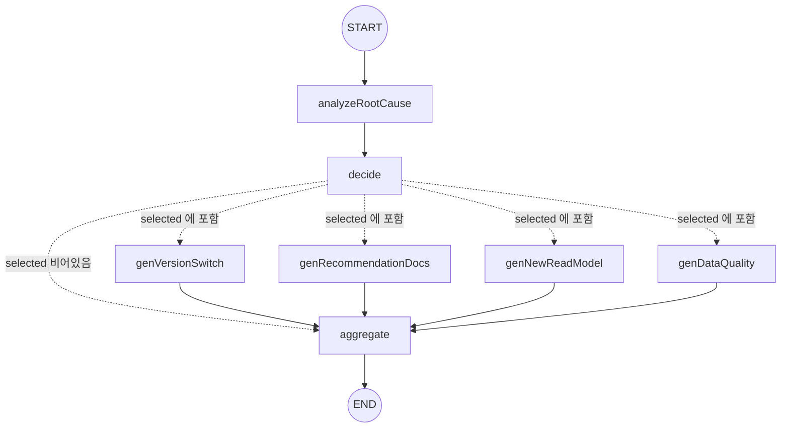

# LangChain/LangGraph 파이프라인 구성

> 생성일: 2026-07-03
> 대상 브랜치: main

## 1. 개요

본 프로젝트는 이벤트소싱+CQRS 구조 위에 **LLM 영역**을 얹은 "Self-Adaptive CQRS" 연구다. 사용자가 기존 Read Model로 채울 수 없는 요청을 하면, 사람이 매번 새 Read Model을 설계·구현해야 하는 병목을 LLM으로 완화한다. 로그(개발자 Logging)와 Insight Read DB를 컨텍스트로 받은 LLM이 이상을 감지하면, **권고 문서 + Read Model 생성 SQL + API Versioning** 3요소를 항상 함께 담은 단일 Docs(.md)를 생성한다.

이 산출 과정을 LangGraph의 `StateGraph`가 오케스트레이션한다. 로그 이상 배치가 들어오면 값싼 모델이 1차 선별(prejudge)하고, 트립하면 근본원인 분석 → 의사결정(어떤 생성기를 돌릴지) → 필요한 생성기만 병렬 fan-out → 결과 조립 순으로 그래프가 실행된다. 각 노드는 "산문으로 추론 후 펜스드 JSON"을 출력하고, zod 스키마로 구조를 검증한다.

## 2. 패키지·모델 구성

| 패키지 | 버전 | 역할 |
|---|---|---|
| `@langchain/core` | ^1.1.49 | `SystemMessage`/`HumanMessage`/`AIMessageChunk` 등 메시지 코어 |
| `@langchain/langgraph` | ^1.4.5 | `StateGraph` 기반 그래프 오케스트레이션 |
| `@langchain/openai` | ^1.4.7 | `ChatOpenAI` — OpenAI 호환 엔드포인트 클라이언트 |
| `@langchain/ollama` | ^1.2.7 | 설치만 되어 있고 `src/` 전체에서 미사용(grep 확인 — import 0건) |
| `zod` | ^4.4.3 | 출력 스키마 계약 + 구조 검증 |

(`package.json:28-48`)

LLM 연결은 모두 OpenAI 호환 엔드포인트를 가정하며, 실제 모델명은 하드코딩 없이 환경변수로 주입된다.

| 설정 | 파일 | 값 |
|---|---|---|
| 공통 연결 | `src/shared/llm/llm-connection.config.ts:1-4` | `baseUrl = LLM_BASE_URL`, `apiKey = LLM_API_KEY` |
| 분석 그래프용 | `src/analysis/analysis.config.ts:1-7` | `model = ANALYSIS_MODEL`, `temperature = 0` |
| 선판단(prejudge)용 | `src/llm-context/screener/prejudge.config.ts:1-7` | `model = PREJUDGE_MODEL`, `temperature = 0` |

두 설정 모두 `temperature: 0`으로 고정된다 — §5의 재시도 설계가 이 결정성을 전제로 한다.

## 3. 파이프라인 토폴로지

`buildAnalysisGraph()`(`src/analysis/annalysis.graph.ts:19-63`)가 정의하는 그래프:



`decide` 다음의 조건부 에지(`graph.addConditionalEdges`, `annalysis.graph.ts:36-54`)는 라우팅 함수가 **문자열 배열**을 반환하는 방식으로 병렬 fan-out을 구현한다: `state.decision.selected`(0~3개의 `OutputKind`)를 `ROUTE` 맵(`annalysis.graph.ts:12-17`)으로 노드 이름 배열로 변환해 반환하면, LangGraph가 그 배열의 모든 노드를 동시에 실행한다. `selected`가 빈 배열이면 생성기를 거치지 않고 곧장 `aggregate`로 간다 — 카탈로그 조회 실패처럼 "조치 불필요"로 확정된 경우다.

## 4. 상태(AnalysisState) 채널

`src/analysis/analysis.state.ts:10-46`, `Annotation.Root`로 정의:

| 채널 | 타입 | reducer | 설명 |
|---|---|---|---|
| `window` | `AnomalyLogWindow \| null` | 최신값 교체 | 로그 라인 입력(±N 윈도우) |
| `sensorFinding` | `SensorAnomalyFinding \| null` | 최신값 교체 | 센서 라인 입력. `window`와 상호배타적 — 어느 쪽이 non-null인지가 로그/센서 라인 판별자(`decision.node.ts:47` 주석 참고) |
| `insightCards` | `string` | 없음 | Insight Read DB 렌더링 결과 |
| `docId` / `generatedAt` | `string` | 최신값 교체 | Docs front-matter 메타. 서비스가 `graph.invoke()` 호출 시 주입 |
| `rootCause` | `RootCauseAnalysis \| null` | 최신값 교체 | `analyzeRootCause` 산출 |
| `decision` | `AnalysisDecision \| null` | 최신값 교체 | `decide` 산출 — 어떤 생성 노드를 fan-out 할지 |
| `outputs` | `GeneratedOutputs` | `(prev, next) => ({...prev, ...next})` | **병렬 fan-out 머지 지점.** 각 생성 노드는 자기 키만 채운 부분 객체를 반환해도 이전 상태와 얕은 병합된다(`analysis.state.ts:38-41`) |
| `report` | `string \| null` | 최신값 교체 | `aggregate` 최종 산출 마크다운 |

`outputs`의 reducer가 없다면 병렬로 끝난 노드 중 마지막 하나만 남고 나머지가 덮어써진다 — spread 병합이 fan-out 아키텍처의 핵심 전제다.

## 5. LLM 호출 규약 — 산문 CoT → 펜스드 JSON → zod → re-ask

모든 그래프 노드의 LLM 호출은 `invokeNode<T>(rolePrompt, facts, schema)`(`src/analysis/nodes/invoke.ts:14-54`) 하나를 거친다.

1. `messages = [SystemMessage(rolePrompt), HumanMessage(facts)]`로 시작.
2. `model.invoke(messages)` 호출 → 모델은 산문으로 추론한 뒤 마지막에 ` ```json ... ``` ` 블록을 낸다.
3. `contentToString(response.content)`로 메시지 콘텐츠(문자열 또는 파트 배열)를 평문화하고, `extractJson()`이 정규식 `/```json\s*([\s\S]*?)```/i`으로 펜스 블록을 추출한다(펜스가 없으면 첫 `{`~마지막 `}` 슬라이스로 폴백, `src/shared/llm/llm-json.ts:19-27`).
4. `schema.parse(...)`로 구조를 검증해 성공하면 즉시 반환.
5. 검증 실패 시(`invoke.ts:38-49`) **직전 AIMessage 응답 자체**와 에러 내용을 담은 `HumanMessage`를 대화에 그대로 누적하고 재요청한다(re-ask). `MAX_ATTEMPTS = 2`(`invoke.ts:12`)라 최대 1회만 재시도한다.
6. 재시도도 실패하면 마지막 에러를 그대로 throw한다(`invoke.ts:53`).

이 설계의 근거는 `invoke.ts:8-11`의 주석에 명시되어 있다: **temperature 0에서 동일 프롬프트를 그대로 재전송하면 같은 실패가 결정론적으로 재현되므로 블라인드 재시도는 무효**다. 그래서 재시도 시에는 모델이 "자기가 방금 낸 잘못된 출력"과 "그게 왜 틀렸는지"를 대화 맥락에 직접 보게 해 스스로 고치도록(re-ask) 유도한다.

`src/analysis/nodes/invoke.spec.ts`가 이 계약을 3가지 시나리오로 검증한다:
- 1차 응답이 스키마에 맞으면 재시도 없이 반환(`invoke.spec.ts:23-30`).
- 1차 실패 → 2차 성공 시, 2차 호출의 메시지 배열이 정확히 `[system, human(facts), 실패한 ai 응답, 에러 피드백 human]` 4개이며, 실패 응답 원문(`"wrong"`)과 피드백 문구("스키마 검증에 실패", "다시 출력하라")가 실제로 대화에 실려 있는지 확인(`invoke.spec.ts:32-55`).
- 두 번 모두 실패하면 예외를 던지고 정확히 2회만 호출됐는지 확인(`invoke.spec.ts:57-64`).

## 6. 노드 카탈로그

| 노드 | 파일 | 프롬프트 | 출력 스키마 | 실패/degrade 정책 |
|---|---|---|---|---|
| `analyzeRootCause` | `nodes/root-cause.node.ts:7-21` | `sensorFinding` 유무로 `ROOT_CAUSE_PROMPT` 또는 `SENSOR_ROOT_CAUSE_PROMPT` 선택 | `rootCauseAnalysisSchema` | `invokeNode` 재시도 소진 시 예외가 그래프까지 전파(별도 catch 없음) |
| `decide` | `nodes/decision.node.ts:47-78` | `DECISION_PROMPT` | `analysisDecisionSchema` | **결정론 프리게이트** `isCatalogMissOnly()`(13-26행): 트립 앵커가 `insight.card.miss` 단독이고 다른 에러 신호가 없으면 LLM을 아예 호출하지 않고 `selected: []`로 확정 — 프롬프트 지시만으로는 동일 입력에서도 확률적으로 뚫리는 사례가 있었기 때문. LLM을 호출한 경우에도 `enforceCoherentSelection()`(30-45행)이 후처리 불변식을 강제: `newReadModel`/`versionSwitch`(산출물 생성)를 골랐는데 권고 계열(`recommendationDocs`/`dataQualityRecommendation`)이 없으면 `recommendationDocs`를 강제로 추가 |
| `genVersionSwitch` | `nodes/version-switch.node.ts:8-48` | `VERSION_SWITCH_PROMPT` (+ `newReadModel` co-select 시 역할경계 노트, 11-26행) | `versionSwitchOutputSchema` | `catch` → `{ outputs: {} }` (44-47행, 부분 실패가 전체 사이클을 죽이지 않도록 degrade) |
| `genRecommendationDocs` | `nodes/recommendation-docs.node.ts:8-29` | `RECOMMENDATION_DOCS_PROMPT` | `recommendationDocsOutputSchema` | `catch` → `{ outputs: {} }` |
| `genNewReadModel` | `nodes/new-read-model.node.ts:8-33` | `NEW_READ_MODEL_PROMPT` (+ `sensorFinding` 실재 시 `NEW_READ_MODEL_SENSOR_ADDENDUM`, 9-13행) | `newReadModelOutputSchema` | `catch` → `{ outputs: {} }` |
| `genDataQuality` | `nodes/data-quality.node.ts:9-51` | `DATA_QUALITY_PROMPT` | `dataQualityRecommendationOutputSchema` | 센서 라인 전용: `sensorFinding === null`이면 즉시 `{ outputs: {} }`(11-13행). 응답 성공 후 **substring 환각 strip**(34-39행): `sensorEvidence[].observedValue`가 입력 텍스트(`facts`)의 실제 부분문자열이 아닌 항목은 제거하고, 모두 제거돼 근거가 0개면 그 출력 자체를 버림(41-44행). 그 외 `catch` → `{ outputs: {} }` |
| `aggregate` | `nodes/aggregate.node.ts:21-42` | 없음(LLM 미호출, 결정론 조립) | 없음 | `lacksRecommendationBasis()`(9-17행): 산출물 중 `newReadModel`/`versionSwitch`는 있는데 권고 근거(`recommendationDocs`/`dataQualityRecommendation`)가 없으면 — `decide`의 정합성 불변식을 통과했더라도 개별 생성 노드가 런타임에 degrade될 수 있으므로 — 전체 산출물을 버리고 "근거 부족" 일관 문서로 대체 렌더 |

## 7. 그래프 밖 LangChain 사용처 — 2단계(2-pass) 게이트

분석 그래프(비용이 큰 다단계 LLM 호출)를 매 배치마다 돌리지 않기 위해, 두 지점에서 **값싼 모델로 트리거 여부만 먼저 판정**하는 동일한 패턴을 쓴다(둘 다 `PREJUDGE_CONFIG` 사용).

- **`src/llm-context/screener/prejudge.ts:44-70`** — 로그 배치 1차 선별. `SYSTEM_PROMPT`(7-35행)는 "확실한 정상"(정상 요청 흐름, action 없는 프레임워크 로그)과 "이상"(순서 이상·`level>=40`·리소스 404·반복 요청) 기준을 명시하고, 그 어느 쪽도 아닌 애매한 경우는 `triggered=true`로 두도록(fail-open) 지시한다. 산문 추론 후 펜스드 JSON을 `prejudgeCheckedSchema`로 검증(재시도 루프 없음 — 실패 시 예외를 호출자가 catch).
- **`src/sensor-observer/sensor-screener.ts:19-45`** — 센서 값 배치 1차 판정. `observeSensorBatch()`가 `SENSOR_OBSERVER_PROMPT` + 베이스라인 텍스트를 시스템 프롬프트에 합쳐 배치 값이 베이스라인을 벗어났는지를 `sensorObserverVerdictSchema`(`triggered`/`reason`/`offendingSceneKeys`)로 판정한다. 배치는 `renderAnnotatedSensorBatch`(`sensor-batch-annotator.ts`)로 렌더되어, 코드가 결정론적으로 계산한 **통계 주석**(robust-z 이상치·회전행렬 항등식 위반 `⚠ stat` 라인)이 걸린 레코드에 첨부된다 — min/max로는 못 잡는 범위 안 이상치·가짜 회전행렬을 근거로 제공하되 판정 주체는 LLM이다(산수는 코드, 해석·트리거는 LLM).

두 스크리너 모두 "트리거 여부"만 결정하고, 실제 근본원인·해결책 판단은 트립 이후 분석 그래프(§3~6)의 몫이다.

## 8. 진입점과 검증 계층

**진입점**: `src/llm-context/llm-context.service.ts`
- `runLoop()`(43-71행): Kafka 로그를 자기 재스케줄 루프로 드레인. LLM이 트립했으면 즉시 재확인(지연 0), 아니면 폴링 간격만큼 대기 후 재확인 — 트래픽에 맞춰 폴링 빈도가 스스로 조정된다.
- `detectOnce()`(73-98행): `consumer.drainOnce()`로 배치를 뽑고, `prejudge()` 호출 → 트립하면 `analyze()` 실행.
- `analyze()`(100-133행): `LOG_WINDOW` 리포지토리로 `AnomalyLogWindow`를 만들고, `InsightService.renderAllCards()`로 Insight 카드를 렌더한 뒤 `graph.invoke({ window, insightCards, docId, generatedAt })`를 실행. 결과 리포트를 파일로 쓰고(`writeReport`, 135-147행 — `src/analysis/output/analysis-<correlationId>.md`), `validateDocs()`로 계약을 검증한다.
- 검증 결과는 **`info` 레벨로만 로깅**한다(119-121행 주석) — 이 서비스의 로그 자체도 Kafka로 재유입돼 prejudge를 거치므로, 검증 실패를 `warn`/`error`로 찍으면 자기 로그가 이상 탐지를 재트리거하는 피드백 루프가 생기기 때문이다.

**검증 계층 3단** — 각 단이 잡는 것과 못 잡는 것:

1. **zod 구조 검증**(`invokeNode` 내부, §5) — JSON 파싱 실패·필드 누락·타입 불일치·`newReadModelOutputSchema.proposedName`의 `read_` 접두 regex 위반 등 **구조적** 오류를 잡는다. 값이 구조적으로 올바른 형(예: 문자열 타입)이면서 내용이 지어낸 것인지는 판별하지 못한다.
2. **substring 환각 strip**(`data-quality.node.ts:34-39`, §6) — `dataQualityRecommendation.sensorEvidence[].observedValue`가 입력 배치 텍스트에 실제 존재하는지만 개별 필드 단위로 검증한다. 이 한 필드 이외의 서술(`observations`, `interpretation` 등)이 사실에 부합하는지는 검증 범위 밖이다.
3. **Docs 계약 검증**(`src/analysis/validate-docs.ts`) — 최종 마크다운이 스펙을 지키는지 결정론으로 검사: (a) front-matter(`---` 블록) 존재, (b) 필수 3섹션(권고/DDL/API Versioning)이 고정 순서로 존재(14-18행), (c) 하단 `Guardrails` 섹션 존재(22-24행), (d) `sufficientEvidence` 플래그와 `INSUFFICIENT_EVIDENCE` 센티넬의 정합성(115-124행), (e) 본문의 `[corr:x]`/`[seq:n]` 인용이 front-matter `evidenceSources` 앵커에 실재하는지(126-138행), (f) 코어 토큰 예산 — 3문자/토큰 근사치로 8,000 초과 시 warning, 20,000(하드캡) 초과 시 error(30-31행, 로컬 소형 모델의 유효 컨텍스트 축소를 감안한 상한). **현재는 결과를 로깅만 하며, 검증 실패가 그래프 재실행이나 루프백으로 이어지지 않는다** — Docs는 실패해도 그대로 저장된다.

## 9. 설계 원칙 — 왜 structured output API 대신 "산문 후 JSON"인가

모든 프롬프트(`src/analysis/prompts/index.ts`)는 OpenAI의 JSON 모드/함수 호출 같은 강제 구조화 출력 API를 쓰지 않고, "자유롭게 산문으로 추론한 뒤 마지막에 펜스드 JSON을 출력하라"는 지시로 통일되어 있다. 이는 소형/로컬 모델에서 grammar-constrained decoding이 추론 단계의 토큰 분포 자체를 제약해 추론 품질을 떨어뜨릴 수 있다는 연구 결과에 근거한다.[^1][^2] `DATA_QUALITY_PROMPT`가 스키마 필드 순서를 근거(`sensorEvidence`)부터 배치해 좌→우 생성 순서로 근거-우선을 강제하는 것(`prompts/index.ts:198-202`)도 같은 맥락 — 형식을 강제로 조이는 대신, 모델이 자연스럽게 산문으로 사고한 결과를 사후에 구조화·검증(§5, §8)하는 쪽을 택한 설계다.

[^1]: arXiv:2408.02442, "Let Me Speak Freely?"
[^2]: arXiv:2606.09410, "Capacity, Not Format"
