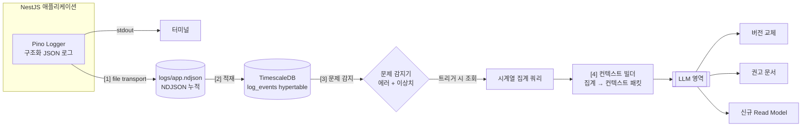

# Logging → LLM 컨텍스트 파이프라인 설계

> **문서 성격**: 설계 문서(아키텍처/데이터 흐름 정의). 본 문서는 코드를 포함하지 않으며,
> 후속 구현 작업의 청사진이다.
> **작성 기준**: `CLAUDE.md` 연구 다이제스트 + `data/research/page1~5.png`(1차 출처, 충돌 시 우선).

---

## 1. 개요 — 연구 내 위치

Self-Adaptive CQRS의 핵심 질문은 **"LLM이 무엇을 컨텍스트로 받아 Read Model을 자가 적응적으로 바꾸는가"**이다.
연구 다이제스트에 따르면 LLM 컨텍스트는 두 소스에서 생성된다.


| 소스                   | 내용                                 | 본 문서 범위                |
| ---------------------- | ------------------------------------ | --------------------------- |
| **(1) 개발자 Logging** | 시스템이 런타임에 남기는 구조화 로그 | ✅**본 문서가 다루는 영역** |
| (2) Insight Read DB    | 도메인 인사이트용 Read DB            | (별도 문서)                 |

본 문서는 **(1) Logging 소스 파이프라인**을 정의한다. 이 파이프라인의 최종 산출물(LLM 컨텍스트)은
LLM 영역으로 입력되어 다음 **3가지 출력** 중 하나로 이어진다.

1. **Read Model 버전 교체** — 기존 Read Model의 다른 버전으로 스위치
2. **Read Model 권고 문서 생성** — 어떤 Read Model을 어떻게 보강할지 가이드 산출
3. **신규 Read Model 생성** — 요청을 만족하는 새 Read Model 자동 구성

즉 본 파이프라인은 **"운영 중 발생한 신호(로그) → LLM이 판단할 수 있는 컨텍스트"**로 변환하는 입력단이다.

# 사용자 요청 4단계 ↔ 본 설계 대응


| 사용자 요청                        | 본 문서 단계                     |
| ---------------------------------- | -------------------------------- |
| ① 터미널 로그를`.json` 파일로     | [1단계] 터미널 로그 → JSON 파일 |
| ② JSON 로그 축적 → Timeseries DB | [2단계] JSON 로그 → TimescaleDB |
| ③ 로그에서 문제 발생 시 DB 조회   | [3단계] 문제 감지 & 조회         |
| ④ 집계한 조회를 LLM 컨텍스트로    | [4단계] 집계 → LLM 컨텍스트     |

---

## 2. 전체 아키텍처 — 4단계 큰 흐름



### 단계별 데이터 변환 요약


| 단계 | 입력                        | 변환                             | 출력                      | 저장소                  |
| ---- | --------------------------- | -------------------------------- | ------------------------- | ----------------------- |
| [1]  | Pino 구조화 로그 객체       | stdout과 동시에 파일로 직렬화    | NDJSON 1줄/이벤트         | `logs/app.ndjson`       |
| [2]  | NDJSON 레코드               | 필드 → 컬럼 매핑                | 시계열 행(row)            | `log_events` hypertable |
| [3]  | 시계열 행                   | 임계/패턴 평가 + 시간윈도우 집계 | "문제 신호" + 조회 결과셋 | (쿼리 결과)             |
| [4]  | 조회 결과셋 + 도메인 스키마 | 요약/구조화                      | LLM 컨텍스트 패킷         | (LLM 입력)              |

---

## 3. [1단계] 터미널 로그 → JSON 파일

### 핵심 전제: 로그는 이미 구조화되어 있다

기존 `src/shared/logger/logger.module.ts`의 Pino 설정은 `LOG_PRETTY=false`일 때 **이미 JSON을 출력**한다.
또한 `src/shared/logger/logging-context.ts`가 `LogContext`(필드명)와 `LogAction`(행위명)을 열거형으로 표준화해
**모든 로그가 동일한 키 스키마를 따른다.** 따라서 별도 파싱 없이 로그 레코드 = 적재 단위가 된다.

### 설계

- Pino **멀티 transport**(또는 `pino/file` 타깃)를 추가하여 stdout 출력과 **동시에** 파일로 기록한다.
- 파일 포맷: **NDJSON**(Newline-Delimited JSON) — 로그 1줄 = JSON 객체 1개. 추가-쓰기(append)로 누적된다.
- 위치(예): `logs/app.ndjson`. 운영 시 일자/크기 기준 로테이션(`app-YYYYMMDD.ndjson`).
- `redact` 설정(authorization, segmentation_points, grip_3d_pose 등)은 파일 출력에도 동일 적용 → 민감정보 누출 방지.

### 로그 레코드 표준 스키마 (기존 `LogContext`/`LogAction` 채택)


| 필드                                                    | 출처         | 의미                                                        |
| ------------------------------------------------------- | ------------ | ----------------------------------------------------------- |
| `time`                                                  | Pino 기본    | 로그 발생 시각(시계열 파티션 키)                            |
| `level`                                                 | Pino 기본    | `info` / `warn` / `error` (문제 트리거의 1차 신호)          |
| `msg`                                                   | Pino 기본    | 사람이 읽는 메시지                                          |
| `action`                                                | `LogAction`  | `insert.batch.done`, `projection.map.failed`, `db.error` 등 |
| `correlation_id`                                        | `LogContext` | 요청 추적 ID(미들웨어가 주입)                               |
| `event_id` / `stream_id` / `global_seq` / `attempt_num` | `LogContext` | ES 이벤트 추적 키                                           |
| `projector_name`                                        | `LogContext` | 투영기 식별(projection lag 분석 키)                         |
| `scene_key` / `object_name`                             | `LogContext` | 도메인 키(이상치 grouping 축)                               |
| `duration_ms`                                           | `LogContext` | 처리 소요(지연 추세 분석)                                   |
| `inserted` / `skipped` / `failed`                       | `LogContext` | 배치 처리 카운트                                            |
| `reason`                                                | `LogContext` | 실패/스킵 사유                                              |

> 운영 고려: 파일은 무한 누적되므로 로테이션 + 보존기간 정책 필요(설계 수준). 적재 후 원본 NDJSON은
> 단기 보존(재처리/감사용)만 하고, 장기 시계열 분석은 [2단계] TimescaleDB가 담당한다.

---

## 4. [2단계] JSON 로그 → Timeseries DB (TimescaleDB)

### TimescaleDB 선택 이유

- 기존 인프라가 **PostgreSQL 17 + Drizzle ORM**(`docker/docker-compose.yml`, `src/shared/database/`). TimescaleDB는
  **PostgreSQL 확장**이므로 새 DB 컨테이너·드라이버·ORM 추가 없이 **hypertable**만 도입하면 된다.
- 기존 `event_store` / `read_*` 테이블과 **동일 커넥션/트랜잭션**에서 다룰 수 있어 운영 부담이 최소.
- `time_bucket`, 연속 집계(continuous aggregate) 등 **시계열 집계 함수**를 SQL로 바로 활용 → [3]·[4]단계 집계가 단순해진다.

### `log_events` hypertable 개념 스키마


| 컬럼                                       | 타입(개념)                | 역할                                      |
| ------------------------------------------ | ------------------------- | ----------------------------------------- |
| `time`                                     | `timestamptz`             | **파티션 키**(hypertable 시간축)          |
| `level`                                    | `text`                    | 에러 트리거 신호                          |
| `action`                                   | `text`                    | 행위 분류(`LogAction` 값)                 |
| `correlation_id`                           | `text`                    | 요청 추적                                 |
| `stream_id` / `global_seq` / `attempt_num` | `text` / `bigint` / `int` | ES 추적 키                                |
| `projector_name`                           | `text`                    | 투영 지연 분석                            |
| `scene_key` / `object_name`                | `text`                    | 도메인 이상치 grouping 축                 |
| `duration_ms`                              | `int`                     | 지연 추세                                 |
| `reason`                                   | `text`                    | 실패 사유                                 |
| `payload`                                  | `jsonb`                   | 위 컬럼에 없는 나머지 로그 필드 원본 보존 |

> 자주 필터링하는 키(`level`, `action`, `scene_key`, `projector_name`)는 인덱스 대상.
> 정형 컬럼 + `jsonb` 보존을 병행해 **스키마 안정성**과 **유연성**을 동시에 확보한다(기존 `event_store`의 payload jsonb 패턴과 동일 철학).

### 적재 경로 옵션


| 옵션                        | 방식                                          | 장점                                               | 단점                                  |
| --------------------------- | --------------------------------------------- | -------------------------------------------------- | ------------------------------------- |
| **A. 파일 tail 적재**       | NDJSON 파일을 별도 워커가 tail → 배치 insert | 앱과 적재 디커플링, 앱 장애와 무관하게 재처리 가능 | 워커 1개 추가 운영                    |
| B. Pino transport 직접 적재 | Pino transport가 직접 DB로 write              | 중간 파일 불필요                                   | 앱-DB 결합, DB 장애 시 로그 유실 위험 |

**권고: 옵션 A.** 사용자 요청(① 파일 → ② DB)의 순서와 일치하고, NDJSON 파일이 **원본 진실(source of truth)** 역할을 하여
적재 실패 시 재처리가 가능하다. 이는 ES의 "Event Store가 원본, Read Model은 재생성 가능" 철학과도 정합적이다.

### 시계열 집계가 쉬워지는 지점

- `time_bucket('5 minutes', time)`으로 **실패율 추세**: `action='projection.map.failed'` 비율을 시간 버킷별 집계.
- `projector_name`별 최신 처리 `global_seq` 추세로 **projection lag**(커서 정체) 관찰.
- `scene_key` / `object_name`별 grouping으로 **도메인 단위 이상 패턴** 관찰.

---

## 5. [3단계] 문제 감지 & 조회 (에러 + 이상치 둘 다)

문제 감지기는 `log_events`를 주기적으로(또는 적재 트리거 시) 평가하여 **두 종류**의 트리거를 발생시킨다.

### 5.1 에러 트리거 (즉시성)

- 조건: `level IN ('error','warn')` 또는 특정 `action` 발생.
- 대상 `action`(기존 코드 기준): `projection.map.failed`, `db.error`, `insert.file.failed`, `event.append.failed`.
- 의미: "지금 무언가 실패했다" — 단건/즉시 신호.

### 5.2 이상치 트리거 (추세성)

- 조건: 시간 윈도우 집계가 임계를 초과.
- 예시:
  - **그립 실패율 급증**: 단위 시간당 `grip_succeed=0` 비율이 기준선 대비 급등.
  - **projection lag 증가**: `projector_name`의 커서가 일정 시간 정체(처리 `global_seq` 정지).
  - **처리 지연**: `duration_ms` 분포의 상위 분위수가 임계 초과.
- 의미: "개별 로그는 정상이지만 패턴이 비정상" — 집계 기반 신호.

### 5.3 트리거 정의 표


| 트리거명                      | 종류   | 소스 신호                                           | 조회 범위                                           | 산출 신호                 |
| ----------------------------- | ------ | --------------------------------------------------- | --------------------------------------------------- | ------------------------- |
| `error.projection_map_failed` | 에러   | `action=projection.map.failed`                      | 직전 시간 윈도우의 동일`stream_id`/`projector_name` | 실패 이벤트 묶음          |
| `error.db`                    | 에러   | `action=db.error`                                   | 직전 윈도우의`db.error` 전체                        | DB 오류 컨텍스트          |
| `error.insert_failed`         | 에러   | `action=insert.file.failed` / `event.append.failed` | 해당 배치`correlation_id`                           | 적재 실패 컨텍스트        |
| `anomaly.grip_fail_rate`      | 이상치 | `time_bucket`별 `grip_succeed=0` 비율               | 최근 N 버킷 ×`object_name`                         | 실패율 추세 + 영향 객체   |
| `anomaly.projection_lag`      | 이상치 | `projector_name`별 커서 정체                        | 정체 구간 전체                                      | 지연 투영기 + 미처리 구간 |

> 조회 쿼리 패턴(개념): **시간 윈도우 필터 + 도메인 키 grouping + 집계 함수**. 트리거가 제공하는
> 시간/키 범위를 그대로 `WHERE time BETWEEN ... AND ... GROUP BY <도메인 키>`로 변환한다.

---

## 6. [4단계] 집계 → LLM 컨텍스트 (논문 핵심)

[3]단계 조회 결과를 LLM이 판단 가능한 **컨텍스트 패킷**으로 구조화한다. 이 변환의 품질이
"LLM이 올바른 Read Model 적응을 결정하는가"를 좌우하므로 **본 연구의 핵심 영역**이다.

### 6.1 컨텍스트 패킷 구성요소


| 구성요소               | 출처                                                                               | 역할                                 |
| ---------------------- | ---------------------------------------------------------------------------------- | ------------------------------------ |
| (a) 도메인/스키마 요약 | 기존 Read Model 목록(`read_grip_result`, `read_multimodal`) + `event_store` 스키마 | LLM이 "현재 무엇을 제공 중인지" 파악 |
| (b) 감지된 문제 요약   | [3]단계 트리거 메타                                                                | "무엇이 문제인지" 명시               |
| (c) 로그 집계 통계     | [3]단계 시계열 조회 결과                                                           | 문제의 정량적 근거(추세/분포)        |
| (d) 사용자 요청        | 외부 입력                                                                          | "사용자가 보고 싶은 데이터"          |

### 6.2 LLM 3출력으로의 매핑


| 컨텍스트 상황                                    | 유도되는 LLM 출력           |
| ------------------------------------------------ | --------------------------- |
| 기존 Read Model의 다른 버전이 요청/문제에 부합   | **① 버전 교체**            |
| 기존 Read Model 보강이 필요하나 자동 변경은 위험 | **② 권고 문서 생성**       |
| 어떤 기존 Read Model도 요청을 만족하지 못함      | **③ 신규 Read Model 생성** |

### 6.3 컨텍스트 패킷 개념 구조 (명시적 필드 — `any` 미사용)

```jsonc
{
  "domainSummary": {
    "eventTypes": ["GripAttemptRecorded"],
    "readModels": [
      { "name": "read_grip_result", "purpose": "그립 성공/실패·포즈 조회" },
      { "name": "read_multimodal",  "purpose": "장면 미디어 링크 조회" }
    ]
  },
  "detectedProblem": {
    "trigger": "anomaly.grip_fail_rate",
    "kind": "anomaly",                 // "error" | "anomaly"
    "window": { "from": "...", "to": "..." }
  },
  "logAggregates": {
    "metric": "grip_fail_rate",
    "buckets": [
      { "bucket": "...", "objectName": "...", "total": 0, "failed": 0, "failRate": 0.0 }
    ]
  },
  "userRequest": {
    "text": "객체별 실패율 추세를 보고 싶다"
  }
}
```

> 각 필드는 명시적 타입으로 정의한다(zod 스키마/인터페이스). `detectedProblem.kind`는
> `"error" | "anomaly"` 리터럴 유니온으로, 트리거는 §5.3의 트리거명 집합으로 제약한다.

---

## 7. 데이터 흐름 요약 & 다음 단계

### 입력 → 출력 → 저장소 요약


| 단계 | 입력            | 출력               | 저장소                   | 재사용 인프라                            |
| ---- | --------------- | ------------------ | ------------------------ | ---------------------------------------- |
| [1]  | Pino 로그 객체  | NDJSON 레코드      | `logs/app.ndjson`        | `logger.module.ts`, `logging-context.ts` |
| [2]  | NDJSON 레코드   | 시계열 행          | `log_events`(hypertable) | Postgres 17,`drizzle.provider.ts`        |
| [3]  | 시계열 행       | 문제 신호 + 결과셋 | (쿼리 결과)              | TimescaleDB`time_bucket`                 |
| [4]  | 결과셋 + 스키마 | 컨텍스트 패킷      | (LLM 입력)               | `read_*` 스키마 메타                     |

### 본 문서 범위 & 후속 구현 작업(별도)

본 문서는 **설계까지**다. 실제 구현은 다음 후속 작업으로 분리된다.

1. Pino 파일 transport 설정 추가([1])
2. TimescaleDB 확장 활성화 + `log_events` hypertable 마이그레이션([2])
3. NDJSON tail 적재 워커([2] 옵션 A)
4. 문제 감지기(에러 + 이상치 트리거)([3])
5. 컨텍스트 빌더(집계 → 컨텍스트 패킷)([4])

> 각 후속 작업은 `CLAUDE.md` 규칙(`any` 금지, 전체 단어 식별자, 기존 네이밍 일관성)을 준수한다.
